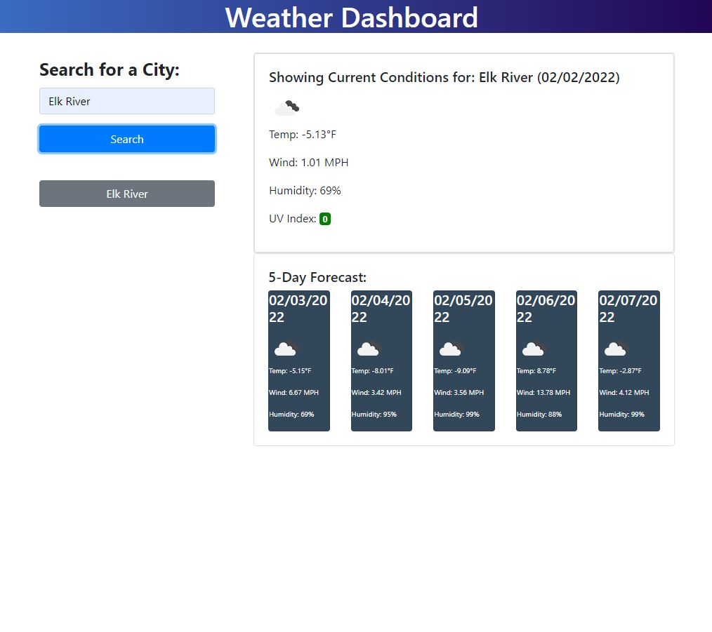

# weather-dashboard

## This webpage was created using JavaScript, HTML and CSS.

## Usage

Looking to  head out of town?  Check the weather before you leave to ensure you're not rained out! (Unless you prefer the rain :wink: )  To use:  simply enter a city in the search bar and you will see the current and future conditions for that city!  You will see the city name, date and an icon representation of the conditions/temperature/humidity/wind speed/ and UV index.  When you select the UV index, you will see a color that indicates if the conditions are moderate, favorable, or severe. 

When looking at future weather conditions, you will see a 5-day forecast that displays the date (along with the icon representation of weather conditions, temp, wind speed, and humidity.) 

There will also be a list of cities you've searched in the past, when you click on the recently searched cities, you will be able to click into them to view the forecasted weather conditions again.  

Click this [LINK](https://kstensing.github.io/weather.dashboard/) for the landing page.

The application should resemble the image below: 

## License

Licensed under the [MIT](LICENSE.txt) license.

